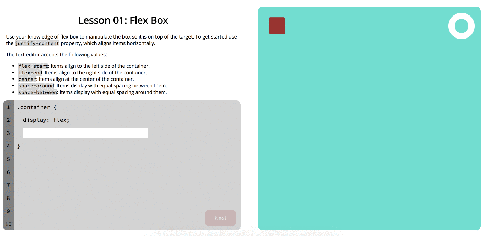

# Exordium

## Synopsis
Exordium is an app built with react and a [backend](https://github.com/seamus-quinn/exordium-backend) built with Node. The purpose of this app is to teach basic HTML, CSS, and JavaScript skills. Some surprise and delight can be found in a few games that help to put some of those skills into practice. You can find a live version of Exordium [here](https://exordium-82cea.firebaseapp.com/)!

---

## Examples

### Homepage

### CSS Game

---
## Contributors

[Jack Laird](https://github.com/JackLaird0) - [Seamus Quinn](https://github.com/seamus-quinn)